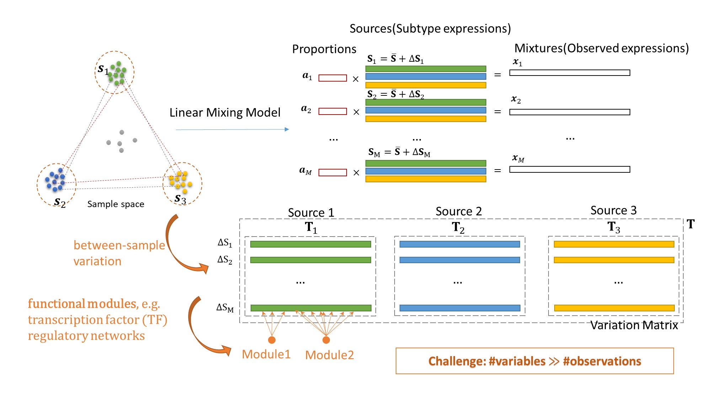
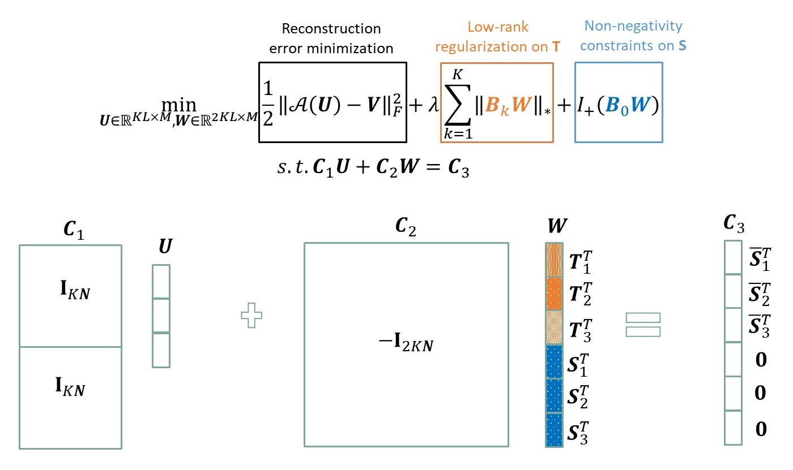
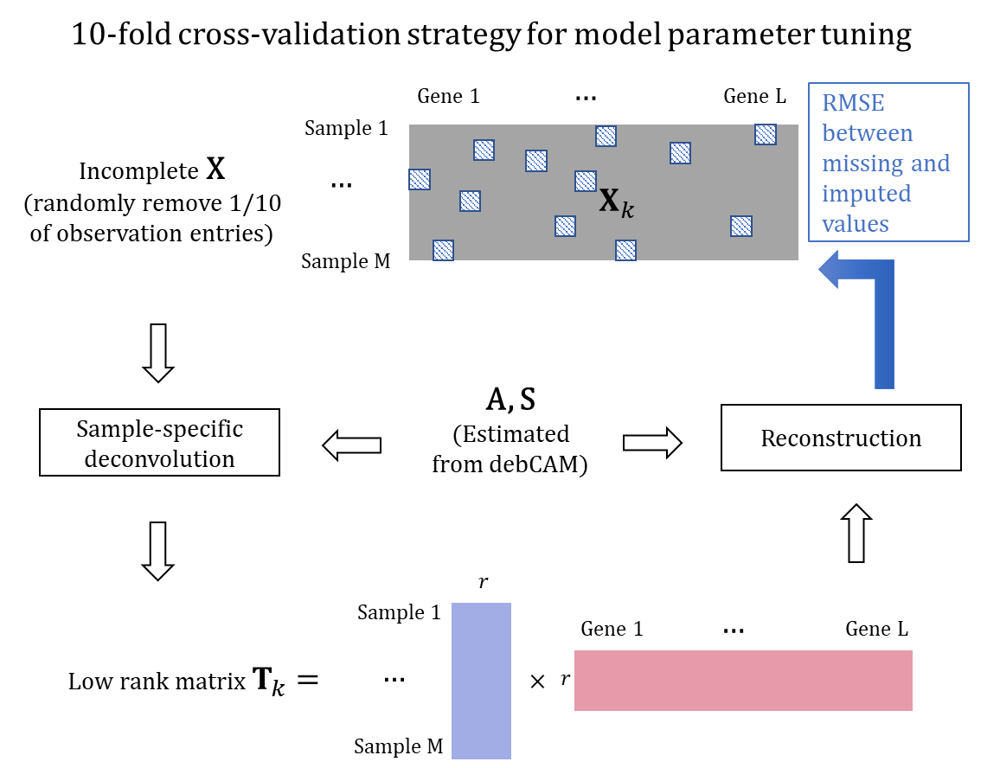

swCAM: Unsupervised Sample-wise Deconvolution
=====

We report a sample-wise Convex Analysis of Mixtures (swCAM) method that can estimate subtype proportions and subtype-specific expressions in individual samples from bulk tissue transcriptomes. We extend our previous CAM framework (https://github.com/Lululuella/debCAM) to include a new term accounting for between-sample variations and formulate swCAM as a nuclear-norm and l_(2,1)-norm regularized low-rank matrix factorization problem. We determine hyperparameter value using a cross-validation scheme with random entry exclusion and obtain swCAM solution using an efficient alternating direction method of multipliers. The swCAM is implemented in open-source R scripts.



Usage
------------

To use swCAM, please download all .R files. Then, please follow the instructions in 'script-swCAM-cv.R' for hyperparameter (lambda) setting. Please follow the instructions in 'script-swCAM.R'.


Quick Start
------------

After download the files, please source the needed function.

``` r
source("sCAMfastNonNeg.R")
```

For the matrix for the sample-wise deconvolution (X), please prepare the proportion matrix (A) and source matrix (S) with our debCAM package (https://github.com/Lululuella/debCAM) or any other method. 

Then, we can use function "sCAMfastNonNeg" for sample-wise deconvolution.
``` r
lambda <- 5 # just an example

rsCAM <- sCAMfastNonNeg(X, A, S, lambda = lambda)
Swest <- rsCAM$S # sample-wise expression
```

Example
------------

Please see "Figure6.R" as an example demonstrated in our paper. Please download all the files to fully replicate the example. For more details, please refer to our paper or the vignette.


Citing
------------
If you have used this tool please cite:

Chen, L., Lin, C. H., Wu, C. T., Clarke, R., Yu, G., Van Eyk, J. E., ... & Wang, Y. (2021). Sample-wise unsupervised deconvolution of complex tissues. bioRxiv, 2021-01. 04.425315.

https://doi.org/10.1101/2021.01.04.425315


Algorithm overview
------------------

The objective function of swCAM for sample-specific deconvolution problem and its reformulation by ADMM. (For convenient illustration, T matrix in all figures are the transposed version of those in the text and equations.)



The cross-validation strategy for model parameter tuning. A part of entries is randomly removed before applying swCAM. The removed entries are reconstructed by estimated T matrix and compared to observed expressions for computing RMSE to decide the optimal hyperparameter lambda.

